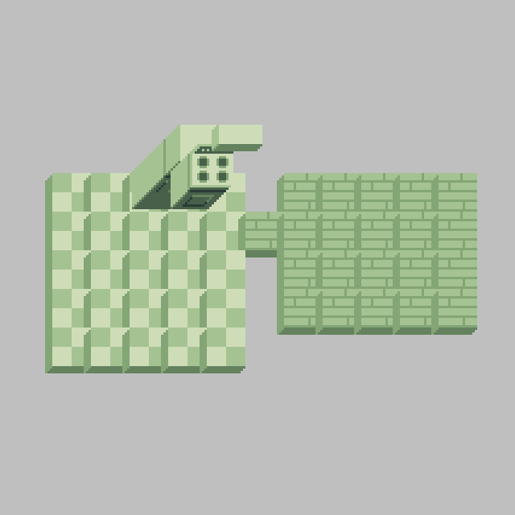
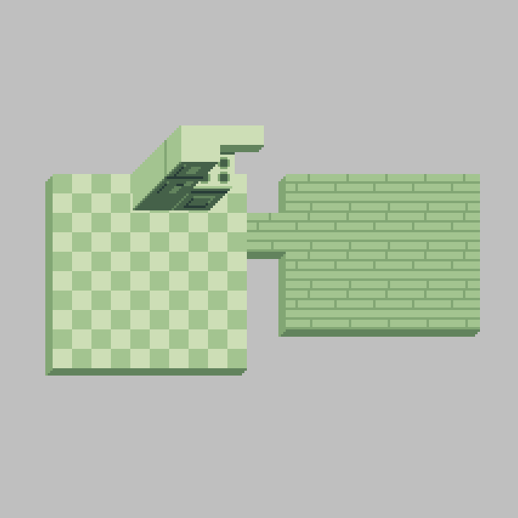

# Tile order test

This is meant as a test case for Phaser issue [#3284: Allow different render orders for Tilemap layers](https://github.com/photonstorm/phaser/issues/3284#issuecomment-391148662).

Current result as rendered in Phaser:

Expected result (as shown in the Tiled editor):

## Installation

* `npm install`

## Usage

`npm start`
